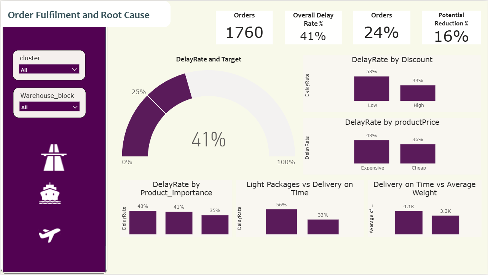
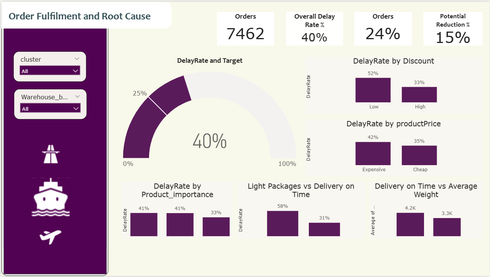
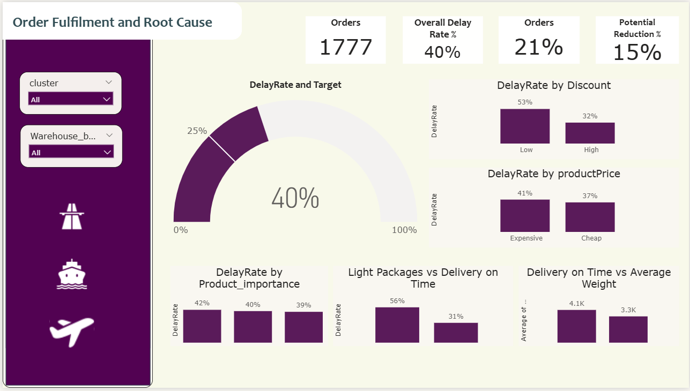

# Order Delay Root Cause Analysis & Risk Profiling (ML + Power BI)

## Project Overview
This project analyzes 11,000+ customer orders to uncover root causes of delayed deliveries and build risk profiles for order fulfillment.  
Using Python (EDA + ML) and Power BI, the analysis identifies operational bottlenecks, quantifies delay drivers, and segments orders/customers into high, medium, and low-risk clusters for better logistics planning.

## 📊 Dashboard Preview





## Business Objective
- Identify key factors driving order delays
- Quantify impact of discounts, weight, value, and other order attributes
- Profile high-risk orders to enable proactive intervention
- Build an interactive Power BI dashboard for stakeholders

## Key Insights
- High Discount & Light Packages: ~20%+ higher delay rates compared to normal orders
- Low Value Products: ~6% higher delays vs high-value items
- Frequent Buyers: 46% delay rate vs 37% for others (+9%)
- Systemic Issue: Delay rates consistent across warehouses & shipment modes → problem lies in processes, not locations

## Tech Stack
- Python: pandas, matplotlib, seaborn, scikit-learn, shap, statsmodels
- Machine Learning: Logistic Regression, Random Forest, Clustering (KMeans)
- Power BI: KPI cards, drill-through, conditional formatting, slicers
- Data Size: 11,000+ orders

## Workflow
1. Data Cleaning & Preparation – Handling missing values, renaming columns
2. EDA & Statistical Tests – Boxplots, Mann-Whitney U, Chi-square
3. ML Modeling – Logistic Regression, Random Forest, SHAP analysis
4. Risk Profiling – Feature flagging & KMeans clustering
5. Visualization in Power BI – Delay rates, top risk drivers, cluster breakdown

## 📁 Folder Structure
<pre><code>```markdown
/CreditCard-Default-Risk/
├── data
    ├── Train.csv
    ├── delivery_clusters.csv
├── icons
    ├── icons8-flight-50.png
    ├── icons8-road-50.png
    ├── icons8-ship-50.png
├── images
    ├── page1.png
    ├── page2.png
    ├── page3.png
├── RootCause.pbix
├── README.md
└── requirements.txt
```</code></pre>
---

## Results & Business Impact
- Built a data-driven risk profiling system to identify top 25% risky orders
- Helped design targeted operational improvements (discount policy, weight prioritization)
- Delivered an interactive dashboard to track delay KPIs in real-time

## Dashboard Preview
(Insert screenshot of your Power BI dashboard here)

## Contact
Vipina Manjunatha  
Email: vipina1394@example.com  

